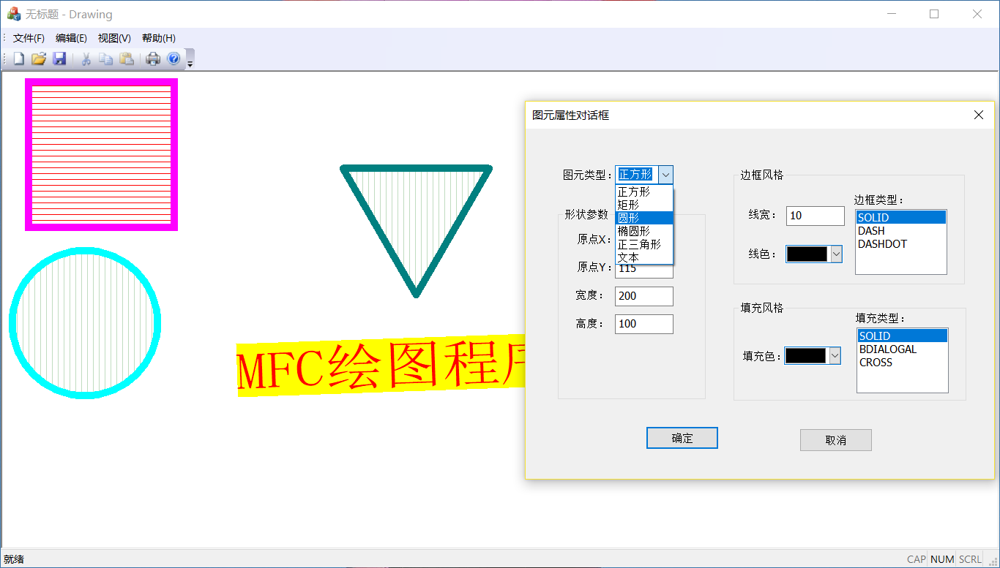
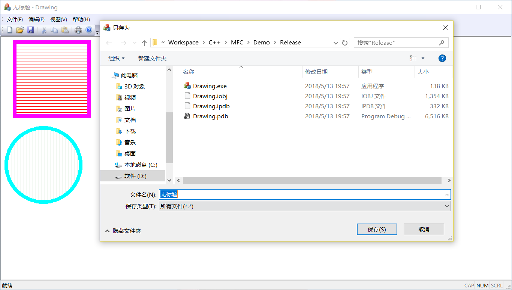

# MFC 绘图程序

## 1. 目录结构说明：

source 文件夹为程序的源码，Vistual Studio 2015 v140的平台。

document 文件夹为整个程序设计的讲解脚本。

## 2. 讲解脚本说明

该脚本是为老师录制 **MFC 课程设计** 视频编写的，每年大二学生都对这个课程设计困惑，当初我也是如此，所以我的指导老师决心录制一套视频来更好的帮助学生做好课程设计。出于对我的信任，这个任务交给了大三菜鸟的我 :smile:。但因作者个人能力有限，内容不足之处还望大家指出。

整个视频脚本共分为八讲。

1、 [课程设计分析](./document/1-课程设计分析.md)

2、[创建MFC应用程序](./document/2-创建MFC应用程序.md)

3、[类的设计和编写](./document/3-类的设计和编写.md)

4、[对话框的创建和使用](./document/4-对话框的创建和使用.md)

5、[程序的执行流程](./document/5-程序的执行流程.md)

6、[一些常见的错误](./document/6-一些常见的错误.md)

7、[课程设计延伸](./document/7-课程设计延伸.md)

8、[课程设计总结](./document/8-课程设计总结.md)

**第一讲 课程设计分析** 将带领同学们解读任务书，明确课程设计的任务。

**第二讲 创建MFC应用程序** 是详细的教同学们使用 VS 来创建MFC应用程序。

**第三讲 类的设计和编写** 将一步步分析类的设计，并给出一个类的具体实现。

**第四讲 对话框的创建和使用** 将详细讲解使用工具箱来搭建出一个对话框界面。

**第五讲 程序的执行流程** 将讲解MFC应用程序绘制图像的整个过程。

**第六讲 一些常见的错误** 是老师把学生们犯的一些很有代表性错误整理出来给大家讲解。

**第七讲 课程设计延伸** 是整个课程设计的升华，这部分内容不属于课程设计任务书的要求，只为更好的改良设计。

**第八讲 课程设计总结** 是对前面八讲内容的串联和总结。

*注：**MFC课程设计视频脚本完整版**只是对八讲内容的整合版本。*

## 3. 程序运行图

程序运行

Ctrl + 鼠标左键绘图，鼠标左键双击已经绘制的图形，进行修改图形。

鼠标右键双击已经绘制的图形，可以删除图形

保存绘图，打开保存的文件

