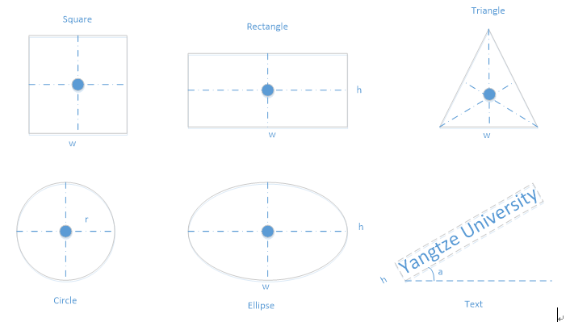
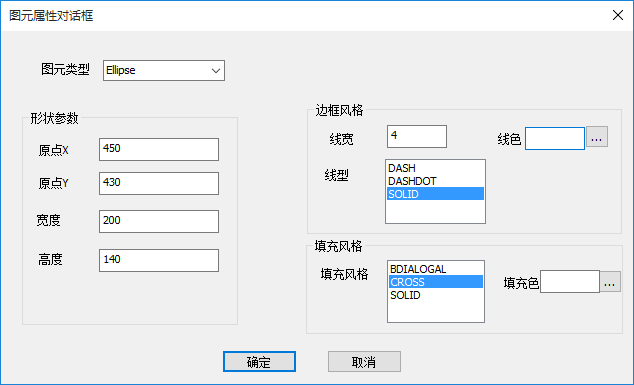

# 第一讲（分析课程设计)

（形式：屏幕录制桌面，老师自我介绍）

同学们，大家好，我是本套 MFC 课程设计视频的讲解老师——刘波涛，大家可以叫我刘老师。

## 1. 为什么会有这套视频

（形式：屏幕录制桌面，老师聊聊本套视频的目的）

这是大家在学完《C语言》和《C++ 面向对象编程》两门课程之后的第一个课程设计，在往年课程设计指导中，老师发现很多同学对于课程设计比较迷茫，简言之，就是不知道做什么。

而一些基础比较好的同学，能做出来部分程序，但不清楚程序内部的运行原理。

所以老师决定出一套讲解 MFC 课程设计的视频，其目的不只是教大家完成本次的课程设计，相信对你以后的课程设计也会有指导作用。

## 2. 解读课设任务书

（形式：屏幕录制打开的任务书，老师解读文档）

在收到课程设计任务书后，我们要根据任务书上的要求来完成课程设计，下面老师就带领大家解读本次课程设计的任务书。 

需要重点关注 **课程设计的要求** ，（鼠标移到 课程设计的功能要求，一边解读，一边鼠标跟随）本次课程设计是要求我们编制一个简单的图形编辑系统。

这个系统都有什么功能呢？可以添加、修改和删除图形元素，绘制下面这幅示例图中的图形。（鼠标放在示例图上）

大家可以看看这张图上的六种图形，有正方形 Square、矩形 Rectangle、正三角形 Triangle、圆形 Circle、椭圆形 Ellipse、文本 Text。

通过对课程设计的要求分析，我们可以得出我们要做的是一个绘图程序，绘制正方形，圆形，文本等六种图形，功能是绘制新的图形，修改已有的图形，删除已有的图形。

具体怎么绘制，修改和删除呢？同学们，我们接着往下看。（鼠标接着图片下面的文字移动）

绘制一个图形，我们可以先找到图形的原点，也就是图形的中心点（鼠标指一指图上的点）。

如果绘制的图形是正方形，那么只要再给出正方形的边长，我们就可以确定这个正方形了。

另外还有图形的填充需要我们考虑，用什么模式填充，这里呢？就涉及到绘图的具体细节了。

我们在绘图的时候呢，在确定要绘图的位置之后，还需要确定图形画成什么模样，图形的边框是虚线还是实线？图形内是实心填充还是阴影填充？大家可以在纸上画一画想一想。

通过上面的讲解，我们已经知道了绘制图形需要一些参数，比如边长，边框类型，填充类型等等。

我们怎么输入这些参数呢？

我们之前写的程序都是Win32应用程序，比如刚开始学习编程时在控制台窗口输出的 “Hello，World！”，正式宣告我们踏入编程世界的大门，程序的输入输出都是在控制台中完成的。

而本次的课设，要求我们在一个参数对话框中来完成我们的参数输入，大家可以看一下任务书中的示例图。（鼠标指向图元属性对话框示例图）

系统的功能是创建，修改，删除图形，具体的程序和用户的交互逻辑是按住 Ctrl键 + 点击鼠标左键来创建图形，鼠标左键双击编辑修改图形，鼠标右键双击删除图形。

关于图形类的设计，后面我们会专门有一讲来说。

任务书下面是一些辅助代码和一些安排说明，大家先看一看。
