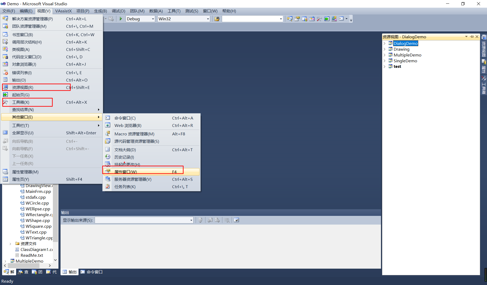
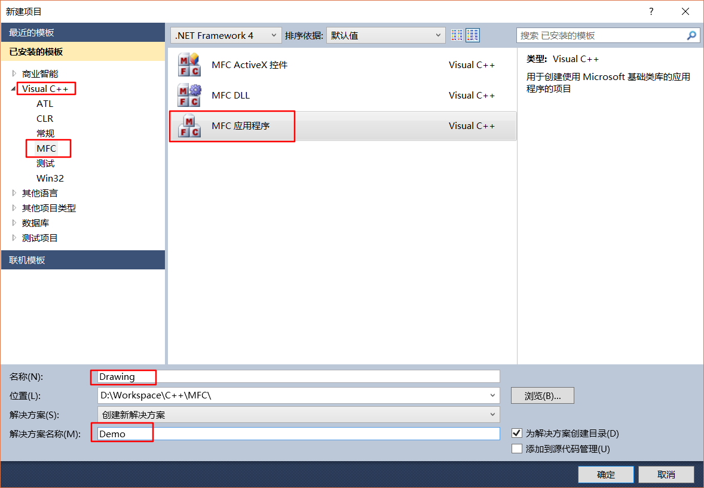
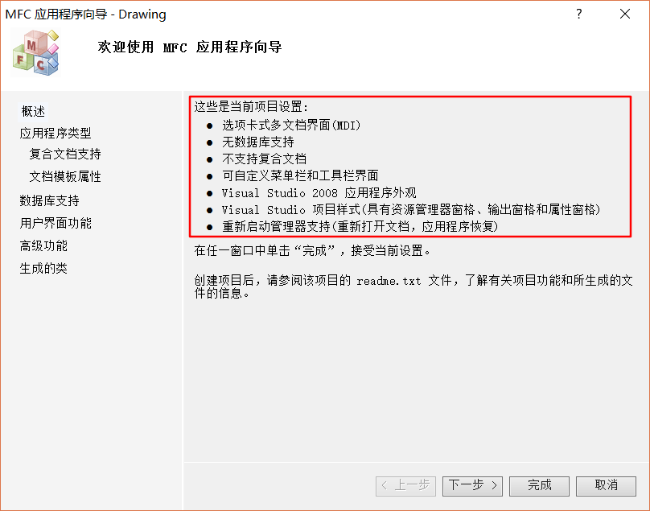
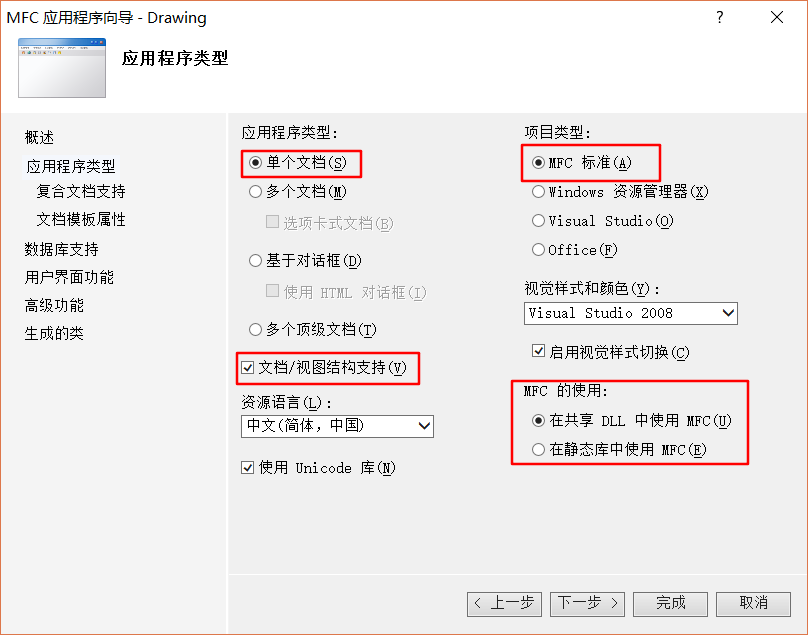
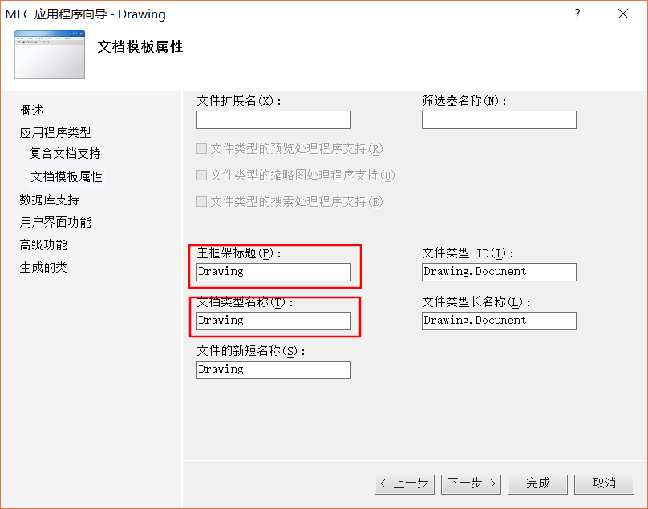
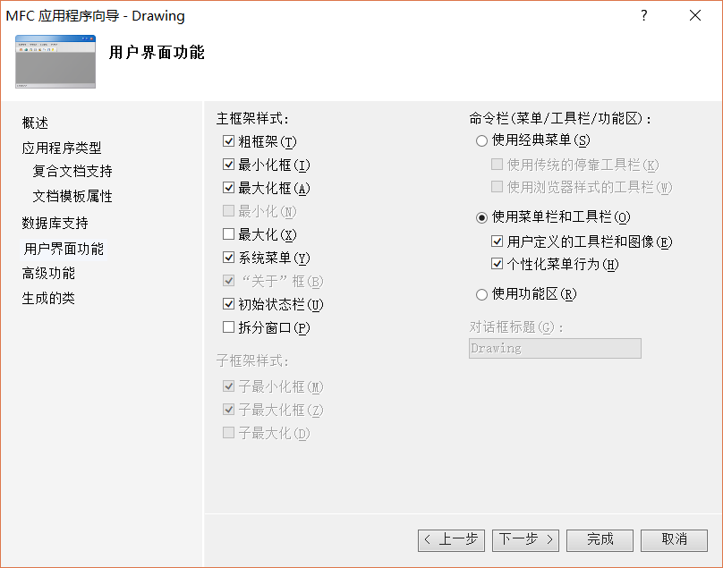
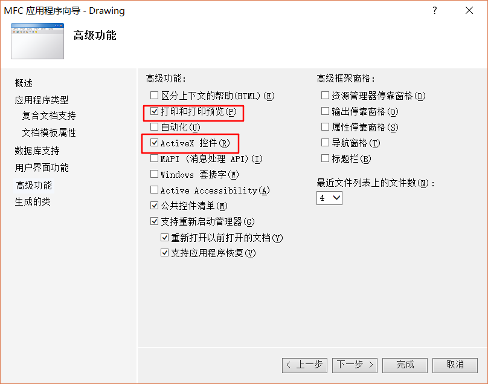
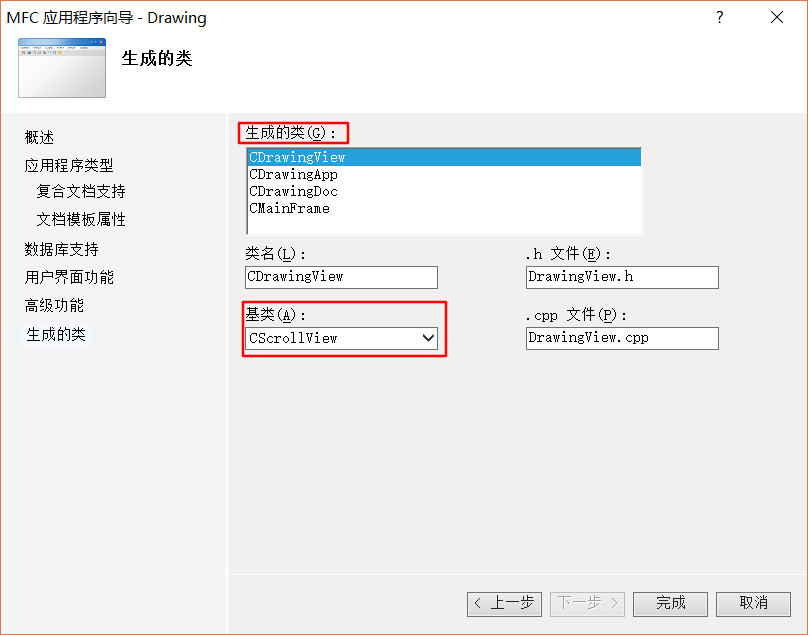

# 第二讲（创建 MFC 应用程序）

（形式：VS 实际操作演示）

## 1. 创建 MFC 应用程序

这一讲，我们将创建我们的 MFC 应用程序

首先打开我们的开发工具，Vistual Studio 2010（边说边打开），同学们在电脑上装 VS2010 之后的版本都可以。

为了我们操作方便，我们先把我们的 VS2010 的某些视图调出来，打开 VS2010 上面的视图选项栏（边说边操作），找到**资源视图**、**属性窗口**、**工具箱**，把它们放在合适的地方，我习惯停靠在右边，**解决方案资源管理器**我习惯放在左边。

下面我们就来新建一个项目（边说边操作），点击 **文件** —> **新建** —> **项目**，使用 **Visual C++ 模版**中的 **MFC** 模版，选择 **MFC应用程序**，输入**解决方案名称**和**项目名称**。

点击确定，下面我们就使用 MFC 的应用程序向导来创建我们的 MFC 应用程序。

MFC 应用程序向导，可以帮助我们快速搭建 MFC 应用程序所需的框架文件，我们通过它，可以更改 MFC 应用向导默认的项目设置。

点击下一步（边说边操作），根据我们的课程设计任务书上的要求，我们的**应用程序类型**是**单个文档**类型，我们改一下。

注意这个 **文档/视图结构支持** 需要选中，因为视图是我们绘图的地方，文档是我们存放图形的地方。

单文档和多文档的区别，这里简单说一下。

先来说一下多文档程序，来看我们的 VS IDE，我们可以同时打开多个文件，鼠标点击切换到不同的文件编辑。（边讲解变演示）

而单文档程序单个程序只能打开一个文件，操作一个文件，Windows 系统自带的记事本程序就是单文档程序。

很明显，单文档程序要相对简单些。

Unicode 库是选择代码的字符集编码，Unicode 是国际化的编码，默认选中。

**项目类型**默认就是 **MFC 标准**，关于 MFC 的使用呢？有两种，一种是 **在共享 DLL 中使用 MFC**，另一种是 **在静态库中使用 MFC**。

这两种有什么区别呢？

在共享 DLL 中使用是在你运行 exe 程序时链接系统中的 DLL，也就是动态的链接，如果系统中没有所需的 DLL文件，程序就会运行失败。

而在静态库中使用 MFC，是将程序所需的 DLL 文件放在项目目录下，不管系统中有没有程序所需的 DLL文件，程序都可以正常运行，这是一种静态链接。

很显然，动态链接方式程序的体积要小于静态链接方式的程序。

我们在这里就选择动态链接的方式吧。

点击下一步（边说边操作），因为我们选择的是单个文档类型，就不需要**复合文档支持**了，再次点击下一步。

文档模版属性，我们来看一下，主框架标题的名称和我们项目的名称一样，文档类型的名称也是，我们不需要改什么，直接点击下一步。

**数据库支持**，我们的项目用不到数据库，所以我们的**数据库支持**选无，点击下一步。

**用户界面功能**，主框架样式，我们可以看一下，有粗框架，最大最小化框，最大最小化，这些同学们可以看一看，使用默认的设置即可，点击下一步。

**高级功能**，有**打印和打印预览**，可以将我们绘制的图形打印出来，**Activex 控件**在这里我们用不到，可以不选择，点击下一步。

最后一步，**生成的类**，这里我们可以看到生成了四个类，**CDrawingView**，**CDrawingApp**，**CDrawingDoc**，**CMainFrame**。

其实应用程序还帮我们创建了一个说明本程序的关于对话框类，**CAboutDlg**，这个类在 Drawing.cpp 文件中，我们在后面会详细讲解这个对话框类。

在下面我们可以清楚的看到这四个类对应的 **类名**，**基类**，**.h 头文件** 和 **.cpp 源文件**。

CDrawingView 的基类，默认是 CView 基类，我们可以选择带垂直和水平滚动条的 CScrollView 类，它是从 CView 类继承过来的。

这里，老师先简单的说说这四个类的功能。（一边鼠标点击某个类，一边讲解）

CDrawingView 类，是负责程序界面上的图像改变的，我们将来的绘图就和这个类有关系。

CDrawingApp 类，是整个 MFC 应用程序的入口和开始文件，我们运行程序时，将先运行这个类中的开始方法。

CDrawingDoc 类，是负责存储程序界面上的图像信息的，这个类中有可以将对象序列化成二进制的方法，我们可以用这个方法实现保存操作，反过来，也可将序列化后的二进制文件中的信息恢复成具体的图形对象。

CMainFrame 类，是定义整个应用程序窗口框架的，前面我们使用类向导的过程中，有一步是选择 **用户界面功能** 的，这个就和这个类有关。

点击完成，我们的 MFC 应用程序就已经创建完成了，现在我们就可以点击运行程序，我们会看到有一个 Windows 窗口程序的样子。

到现在，我们并没有写一行代码，这是我们用应用程序向导创建出来的 MFC应用程序，但它没有任何的功能，我们的任务就是给这个半成品的应用程序添加我们想要的功能。

