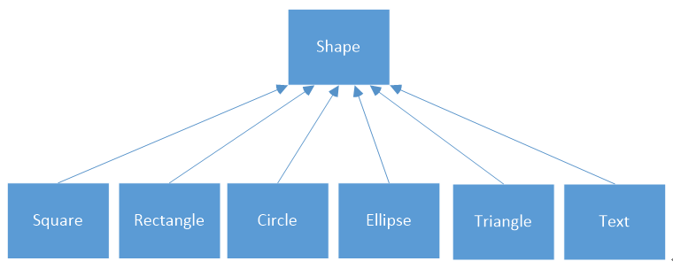

# 第三讲（类的设计和编写）

## 1. 类的设计

(形式：根据课程设计任务书讲解)

经过前面课程中的分析，我们知道我们要做一个绘制图形的 MFC 应用程序，下面我们来分析这个应用程序所需的图形类。

我们要用面向对象的思想来看我们这个应用程序，我们要在计算机中绘制某个图形，我们是不是可以把这个图形看成一个对象，这个对象有什么特点，就是我们类中的成员变量，或者说是属性，我们对这个对象的操作就是类中的成员函数、或者说是方法。

那么下面我们的任务就是分析出图形·类的属性和方法。

我们先来分析类所需要的属性，我们在前面需求分析里，知道我们要绘制正方形，矩形，圆形，椭圆形，正三角形，文本六种类型的图形。

打开我们的课程设计任务书，我们先来看一看这些图形的特点。（根据图片上的图形分析属性）


找到这张图，我们找找各个图形的相同点和不同点。

每个图形都有一个中心点，边框的样式，填充的样式，中心点是我们绘图的依据点。

而正方形有边长，矩形有长宽，圆形有半径，椭圆形有长半径和短半径，正三角形也有边长，文本有文本的内容和文本倾斜的角度。

这些就是我们需要的属性，我们再来看看每个类所需要的方法。

既然我们要绘制图形，绘图的方法啊，肯定少不了啦，我们想要修改图形，那么重新绘制图形的方法也需要，另外还有删除图形和保存图形的方法我们也需要。

同学们此时是否已经在脑海中有类设计的想法了呢？课程设计任务书上，也提供了类设计的方案，但这种设计有没有不足之处呢？大家先想一想。



通过上面的分析，我们找到了图形之间的相同点，也发现了图形之间的差异，我们类的设计其实就是抽出这些异同点。

## 2. 绘图原理

（形式：鼠标移动到所讲之处）

我们要想在电脑中绘制我们的图形，我们就需要对在电脑绘图的原理有一个基本的了解。

先来看看平时我们是怎么在纸上画图的，我们肯定要先准备笔和纸，先后确定画的位置和图形的模样，我们就可以开始画了。

在 Windows 系统中，我们看到的每一个图像都是绘制出来的，绘制过程和平时画图类似。

大致的步骤为：获取设备环境，设置坐标映射，创建绘图工具，调用绘图函数绘图。

显示器、打印机都是设备环境，显示器有大有小，分辨率也有高低，硬件环境很复杂。

而我们编程人员，并不需要关注太多底层的信息，我们使用这些设备要通过操作系统来间接调用，Windows 系统为我们封装了绘制图形的相关函数，我们只需要学会使用他们。

前面说到 MFC 是对 WIndows API 函数的一种封装，MFC 中当然也封装了有和绘图相关的类。

设备环境类 CDC，用于设置绘图的属性（例如边框类型和填充类型）和绘制图形。

绘图对象类 CBrush，CFont，Cpen等，根据设备环境类的设置绘制具体的图形。

和我们在纸上画图一样，我们知道了图形怎么画，还要给要画的图形定个位置，也就是图形坐标。

在 Windows 坐标系中，X 轴正方向向右，Y轴正方向向下。

Windows 坐标系分为逻辑坐标系和设备坐标系两种，这是两种不同的记录位置的方式。

设备坐标系要考虑物理设备具体的大小，以物理设备的一个像素点位单位设置坐标的单位长度。

而逻辑坐标系不考虑物理设备的具体大小，也是我们我们写程序时绘制图形采用的坐标系，而图形在绘制时，Windows 在把逻辑坐标转换为设备坐标。

关于绘图的相关知识，同学们可以在CSDN看看这篇文章，[MFC GDI 绘图基础](http://blog.csdn.net/phunxm/article/details/5083119)。（打开该链接）

## 3. 类的编写

经过前面类的设计和绘图原理的讲解，下面我们正式开始类的编写。

我们先按照课程设计任务书上的设计方法，编写我们的类，也就是我们编写一个基类，其他图形类继承该类。

基类中的属性肯定是所有图形子类共有的属性，我们来想想都有哪些？

**绘图位置的坐标点X、Y，边框的颜色、线型、宽度，填充的颜色，类型**。

那么同学们再想一想，公共的方法都有哪些？

绘图的方法，修改图形的方法，删除图形的方法，还有保存的方法。

既然我们要编写类，就有想到具体的写法，比如各个属性的类型选用什么，方法大致怎么实现。

这里我们并不要求绘制图形时位置多么精准，所以我们这里的坐标使用 int 类型即可。

颜色，我们使用 MFC 中的数据类型 COLORREF，边框的线性、宽度、填充的类型我们也都使用 int 类型。

所以到目前为止，我们类的具体属性设计就为：（在VS中编写该类，取名为 WShape）

```c++
int OrgX; //逻辑坐标 X
int OrgY; //逻辑坐标 Y
COLORREF BorderColor; //边框颜色
int BorderType; //边框线型（实线，虚线，虚点线）
int BorderWidth; //边框宽度
COLORREF FillColor; //填充颜色
int FillType; //填充类型（实心，双对角， 十字交叉）
```

再来看看我们的方法，我们绘图时需要知道绘图的位置，然后再根据对象属性的具体内容绘制图形。

绘制好了图形，如果我们想修改，首先是要找要修改的图形，如果是我们想找的图形，我们再对它的属性重新设置，然后再次绘制即可，这样修改方法，需要一个匹配对应函数和修改属性的函数。

删除图形的方法，也需要先找到要删除的图形，在进行删除操作，我们在这里也需要用到匹配对应函数，删除图形其实就是销毁该图形对象，不需要在用其他的函数了。

为了降低难度，我们这里的修改属性只修改图形类中的共有属性，也就是基类中的属性，这样我们只需要在基类中实现一次该方法，所有的子类继承后，都可以调用该方法。

但是这种方法很明显存在缺陷，因为子类中的独有属性是不能修改的，大家能想到更好的方法吗?

有的同学可能会想到使用重载，基类中声明各个图形类的修改属性方法，因为每个图形类的独有属性是不一样的。

我们每新建一个图形子类，都需要在基类中添加对应的修改函数，这样确实可以解决问题，但是这并不是最好的解决方法。

类的设计涉及到软件开发中的设计模式，设计软件最好的原则是 **高内聚，低耦合**。

高内聚就是将一个功分成不可再分割的单个方法，比如我们这里修改图形的功能，是由图形匹配的方法，修改图形属性的方法，重新绘制图形的方法组成的。

图形匹配的方法又被删除功能所用，这样代码重用性就提高了。

低耦合就是要尽量降低各个类之间的关联，继承虽然可以解决问题，但是继承也不是万能的，如果继承的层次很深，那么要进行修改时，很可能就会 **牵一发而动全身**，给我们的代码维护带来很大难度。

**高内聚，低耦合**，这六个字可以说是软件设计的精髓，大家可以上网百度，查找相关的介绍。

保存的方法有些复杂，并且我们首先要知道，MFC 中怎么实现保存操作的。

MFC 的中的基本类 CObject 中有序列化函数 Serialize() 专门是针对对象保存的，我们可以让图形类的基类继承该类，然后在子类中实现序列化函数。

但是要想使用序列化函数，还需要声明和实现序列化的方法，这样该类才能被序列化。

序列化包括将具体的对象保存成二进制文件，也可称为是保存文件操作；还有将二进制文件中的对象信息读取出来，可称为读取文件。

但是我们想把对象保存起来，还需要知道对象的类型，便于区分各个对象的类型，所以我们还需要在基类的属性中加上图形的类型。

图形的类型是有限的，这里我们可以用枚举类型来表示图形的类型。

为了便于子类的继承，我们把基类的共有属性和共有方法都用 **public** 修饰符修饰。

综上所述我们的基类最终为：（在VS中继续编写代码）

``` C++
enum ElementType {SQUARE, RECTANGLE, CIRCLE, ELLIPSE, TRIANGLE, TEXT};
class WShape:public CObject
{
public:
	ElementType Type; //图元类型
	int OrgX; //逻辑坐标 X
	int OrgY; //逻辑坐标 Y
	COLORREF BorderColor; //边框颜色
	int BorderType; //边框线型（实线，虚线，虚点线）
	int BorderWidth; //边框宽度
	COLORREF FillColor; //填充颜色
	int FillType; //填充类型（实心，双对角， 十字交叉）
public:
	WShape();
	virtual void Draw(CDC* pDC) = 0; // 绘制图元函数
	virtual bool IsMatched(CPoint pnt) = 0; // 判断鼠标点是否落在图形内
	virtual void Serialize(CArchive& ar) = 0; // 序列化函数
	void SetAttribute(int orgX, int orgY, COLORREF borderColor, int borderType, int borderWidth, COLORREF fillColor, int fillType); //修改图形属性表函数
	virtual ~WShape();
};
```

在 .cpp 文件中，实现 SetAttribute() 函数（在VS中继续编写代码）

``` c++
void WShape::SetAttribute(int orgX, int orgY, COLORREF borderColor, int borderType, int borderWidth, COLORREF fillColor, int fillType)
{
	OrgX = orgX;
	OrgY = orgY;
	BorderColor = borderColor;
	BorderType = borderType;
	BorderWidth = borderWidth;
	FillColor = fillColor;
	FillType = fillType;
}
```


我们这个基类是一个抽象类，共有的方法也都是抽象方法，具体的实现是在继承它的子类中实现的。

下面老师就带着大家实现正方形图形类的实现。

正方形类相比于基类，独有的属性是边长，基类中的抽象方法我们都要实现，

所以我们的正方形就可以这样写：（在VS中编写该类，取名为 WSquare）

``` c++
#include "WShape.h"

class WSquare :public WShape
{
private:
	int Width; //正方形的边长
public:
	WSquare();
	WSquare(int orgX, int orgY, int width, int borderWidth, int borderType, COLORREF borderColor, int fillType, COLORREF fillColor);
	void Draw(CDC*pDC);
	bool IsMatched(CPoint pnt);
	void Serialize(CArchive& ar);
	~WSquare();
};
```

在前面我们说到序列化是要在子类中声明和实现的，所以我们要在子类中的头文件中加上声明该类支持序列化的语句 `	DECLARE_SERIAL(WSquare); //声明类WSquare是支持序列化` 。（边讲解边加上）

加上后的正方形类代码：

``` C++
#include "WShape.h"
class WSquare :public WShape
{
private:
	int Width; //正方形的边长
public:
	WSquare();
	WSquare(int orgX, int orgY, int width, int borderWidth, int borderType, COLORREF borderColor, int fillType, COLORREF fillColor);
	void Draw(CDC*pDC);
	bool IsMatched(CPoint pnt);
	void Serialize(CArchive& ar);
	~WSquare();
	DECLARE_SERIAL(WSquare); //声明类WSquare是支持序列化
};
```

在 .cpp 文件中，实现这些方法。（在VS中继续编写代码）

我们在头文件中声明了序列化，在源文件中，还需要写实现序列化的语句 `IMPLEMENT_SERIAL(WSquare, CObject, 1)` 。（边讲解便加上）

先来看看无参的默认构造函数，我们怎么写。

我们可以给正方形对象默认的属性值，比如边长是多少，边款的粗细是多少，什么颜色等，这都是可以的。

老师这里只初始化必须要有的属性——对象的类型，其他的就不写了。（边讲解边写上）

``` C++
WSquare::WSquare()
{
	Type = (ElementType)0;
}
```

为了方便我们创建对象，我们可以创建一个有参的构造函数，参数就是对象的所有属性，这个应该难不倒同学们。（边讲解边写上）

``` C++
WSquare::WSquare(int orgX, int orgY, int width, int borderWidth, int borderType, COLORREF borderColor, int fillType, COLORREF fillColor)
{
	Type = (ElementType)0;
	OrgX = orgX;
	OrgY = orgY;
	Width = width;
	BorderWidth = borderWidth;
	BorderType = borderType;
	BorderColor = borderColor;
	FillType = fillType;
	FillColor = fillColor;
}
```

接下来，老师带着大家编写图形的绘图函数。

在前面，我们讲绘图原理时，老师提到绘图需要画笔和刷子，这里就不得不提MFC中封装的两个类了，Cpen 和 CBrush，Cpen是负责绘制图形的边框的，CBrush是负责图形的填充的，是不是类名起的还挺形象的。

我们还需要一个设备环境类，用来设置要绘制图形的位置，MFC中对应的类为 CDC，我们可以使用该对象的指针指向设备环境对象。

在绘制完一个图形时，我们还需要保存原画笔和原刷子，以便下次绘制图形时使用。（边讲解边写）

```C++
void WSquare::Draw(CDC*pDC)
{
	//创建画笔及用来保存原画笔的指针
	CPen pen, *pOldPen;
	pen.CreatePen(BorderType, BorderWidth, BorderColor);
	pOldPen = (CPen*)pDC->SelectObject(&pen);

	//创建刷子及用来保存原刷子的指针
	CBrush brush, *pOldBrush;
	brush.CreateHatchBrush(FillType, FillColor);
	pOldBrush = (CBrush*)pDC->SelectObject(&brush);

	//绘制图形
	pDC->Rectangle(OrgX - Width / 2, OrgY + Width / 2, OrgX + Width / 2, OrgY - Width / 2);

	//使用当前画笔和刷子
	pDC->SelectObject(pOldPen);
	pDC->SelectObject(pOldBrush);
}
```

关于图形匹配函数的编写呢？其实就是判断鼠标的位置是否在图形中，我们肯定是要得到鼠标的坐标了，MFC中封装了鼠标坐标的类，Cpoint。

鼠标位置是否在图形中，就是鼠标坐标是否在图形区域内，MFC 中有个关于图形设备接口（GDI）区域的类 Cpoint，它是专门处理图像区域信息的类。

我们先用该类创造出一个正方形区域，然后用该类中判断坐标点是否在图形中函数来判断。（边讲解边写）

``` C++
bool WSquare::IsMatched(CPoint pnt)
{
	CRgn rgn;
	rgn.CreateRectRgn(OrgX - Width / 2, OrgY - Width / 2, OrgX + Width / 2, OrgY + Width / 2);
	BOOL flag = rgn.PtInRegion(pnt);
	if (flag)
		return true;
	else
		return false;

}
```

对于判断坐标点是否落在正方形图形中，还是比较简单的，而对于椭圆形，文本，会有些复杂，但是大致的思路，同学们一定要知道，可以上网查查，网上都有讲解的。

最后我们来编写序列化函数，序列化的步骤是固定的，大家学会了正方形图形的序列化，对于其他对象可以举一反三。

序列化我们要用到 MFC 中的 CArchive 类，我们可以先看看该类的用法，打开浏览器，搜索 **MFC CArchive**，我们就看看百度百科对它的介绍吧。（[网址链接](https://baike.baidu.com/item/CArchive)）（大致浏览一下）

CArchive 对象提供了一个类型安全缓冲机制，用于将可序列化对象写入 CFile 对象，也就是写到文件中，或者从文件中读取可序列化对象。

CArchive 类，我们可以简单的理解为既可以将对象保存到文件中，又可以将文件中的内容读取出来还原成对象。

所以序列化要考虑是保存操作还是读取操作，通过 IsStoring() 函数的布尔值来判断。（边讲解边写）

void WSquare::Serialize(CArchive& ar)
{

	if (ar.IsStoring())
	{
		//保存文件
		ar << (WORD)Type;
		ar << OrgX << OrgY;
		ar << BorderColor << BorderType << BorderWidth;
		ar << FillColor << FillType;
		ar << Width;
	}
	else
	{
		//读取文件
		WORD w;
		ar >> w;
		Type = (ElementType)w;
		ar >> OrgX >> OrgY;
		ar >> BorderColor >> BorderType >> BorderWidth;
		ar >> FillColor >> FillType;
		ar >> Width;
	}
}

最终，源文件的函数实现就为：（带着同学们大致浏览一下）

``` C++
#include "WSquare.h"

IMPLEMENT_SERIAL(WSquare, CObject, 1)

WSquare::WSquare()
{
	Type = (ElementType)0;
}

WSquare::WSquare(int orgX, int orgY, int width, int borderWidth, int borderType, COLORREF borderColor, int fillType, COLORREF fillColor)
{
	Type = (ElementType)0;
	OrgX = orgX;
	OrgY = orgY;
	Width = width;
	BorderWidth = borderWidth;
	BorderType = borderType;
	BorderColor = borderColor;
	FillType = fillType;
	FillColor = fillColor;
}

void WSquare::Draw(CDC*pDC)
{
	//创建画笔及用来保存原画笔的指针
	CPen pen, *pOldPen;
	pen.CreatePen(BorderType, BorderWidth, BorderColor);
	pOldPen = (CPen*)pDC->SelectObject(&pen);

	//创建刷子及用来保存原刷子的指针
	CBrush brush, *pOldBrush;
	brush.CreateHatchBrush(FillType, FillColor);
	pOldBrush = (CBrush*)pDC->SelectObject(&brush);

	//绘制图形
	pDC->Rectangle(OrgX - Width / 2, OrgY + Width / 2, OrgX + Width / 2, OrgY - Width / 2);

	//使用当前画笔和刷子
	pDC->SelectObject(pOldPen);
	pDC->SelectObject(pOldBrush);
}

bool WSquare::IsMatched(CPoint pnt)
{
	CRgn rgn;
	rgn.CreateRectRgn(OrgX - Width / 2, OrgY - Width / 2, OrgX + Width / 2, OrgY + Width / 2);
	BOOL flag = rgn.PtInRegion(pnt);
	if (flag)
		return true;
	else
		return false;

}

void WSquare::Serialize(CArchive& ar)
{
	if (ar.IsStoring())
	{
		//保存文件
		ar << (WORD)Type;
		ar << OrgX << OrgY;
		ar << BorderColor << BorderType << BorderWidth;
		ar << FillColor << FillType;
		ar << Width;
	}
	else
	{
		//读取文件
		WORD w;
		ar >> w;
		Type = (ElementType)w;
		ar >> OrgX >> OrgY;
		ar >> BorderColor >> BorderType >> BorderWidth;
		ar >> FillColor >> FillType;
		ar >> Width;
	}
}

WSquare::~WSquare()
{
}

```

 剩下的五个图形类呢，由同学们自己来编写，你对老师上面所讲的这些理解明白后，相信对其他的类也有思路了。

遇到问题，比如某个函数你不会实现，同学们可以在网上查查资料，网络是我们最快捷的老师，好好利用，搜索资料也是我们要培养的重要能力，当然同学们也可以互相交流讨论，请教老师。

同学们，我们下讲再见。