# 第四讲 (对话框的创建和使用)

## 1. 关于对话框

（形式：在VS中实际操作，边讲边演示）

同学们，经过前面第四讲图形类的准备，我们下面就开始整个绘图程序的逻辑编写了。

在课程设计任务书中（边说边打开课程设计任务书），要求当按下键盘上的Ctrl键并单击鼠标左键时创建图元，图形的创建由参数对话框来编辑，以鼠标左击时的坐标位置为基点创建图形。

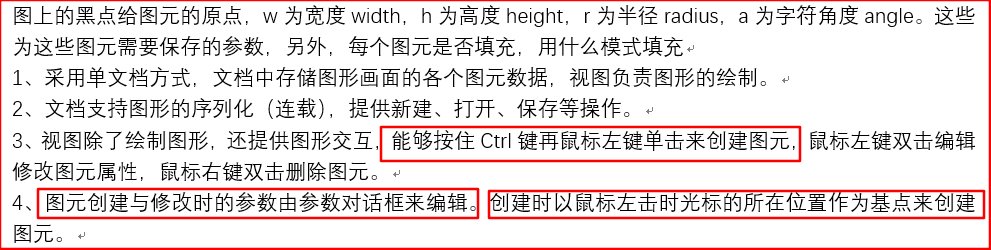

并且在课设任务书的下面，还给出了参数对话框的示例图（鼠标找到示例图）


我们在这个对话框中输入图形的相关参数，将这个对话框界面上的值再赋给图形对象对应的成员变量，调用绘图函数就可以把图形绘制出来了，所以我们首先要来创建一个类似的图元属性对话框。

之前我们用MFC程序应用向导创建完程序之后，就可以运行整个程序了，应用向导已经帮我们默认创建了一个关于这个应用程序的对话框，在哪里呢？带着大家来看一看。

我们把程序运行起来后（老师运行程序），在程序的**帮助**选项卡中点击**关于**选项，会就看到弹出弹出一个关于Drawing的对话框。

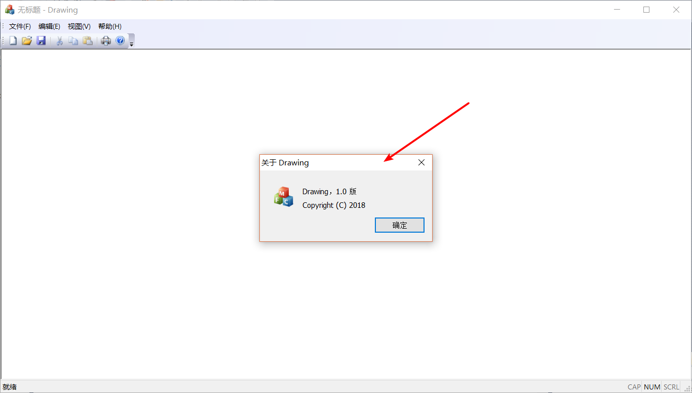

这个对话框是在哪里定义呢？我们打开Drawing.cpp文件（边说边打开），就可以看到这个关于对话框的代码，我们发现这个对话框有对应的类 CAboutDlg，公有继承自 CDialogEx 类。

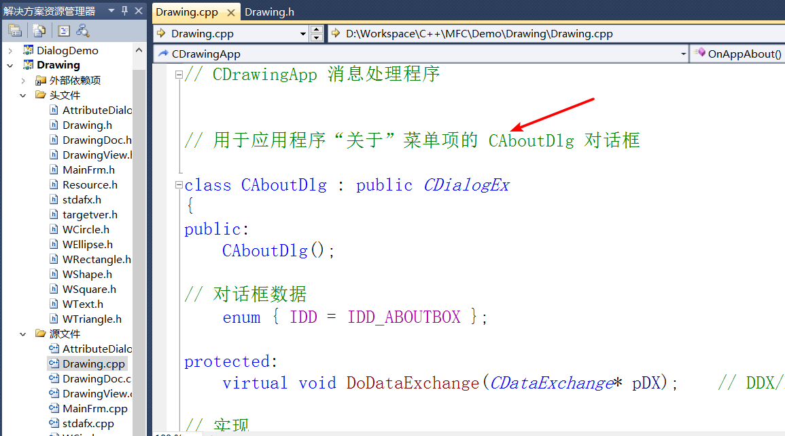

我们还可以在资源视图中的 Dialog 对话框资源中更加直观的看到这个对话框对象，点击IDD_ABOUTBOX ，左边就会出现一个很直观的对话框模型图。

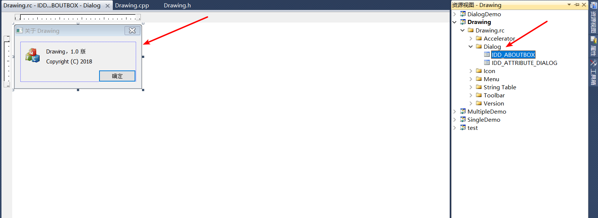

我们可以直接用鼠标对这个对话框模型图操作，比如可以拖动上面确定按钮的位置，还可以在右边属性视图中，看到对这个关于对话框更加详细的属性。

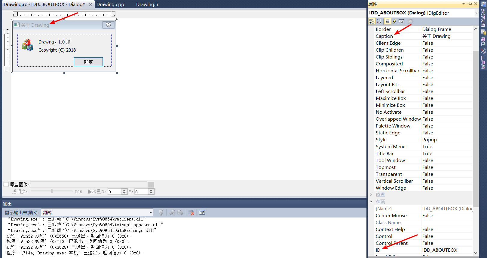

我们先来看两个地方，一个是**Caption**，英文翻译过来就是标题的意思，后面的属性值可以改变关于对话框的标题，我们可以试试。（试着修改Caption属性的值，演示一下）

另一个是**ID**，它是对话框的资源标识，同学们可以看成是资源对象的地址。

好比一个地方，根据不同的取名方法，可以给它取不同的名字，比如说北京，我们可以叫它北京市，但也可以说是中国的首都，这两种说法都是指向的同一个地方。

这点在后面还会讲，大家先有个概念。

其他的属性，同学们可以自己查查，都是什么意思，这里老师就不细讲了。

看完了关于对话框，我们怎样创建图形属性参数的对话框呢？

## 2. 创建新的对话框

对话框对象也是由对话框类创建的，我们想创建一个图形属性对话框，自然也是要有一个对话框类啦！

创建对话框类，我们可以借助类向导，选中我们的**Drawing**项目，右键找到**类向导**。

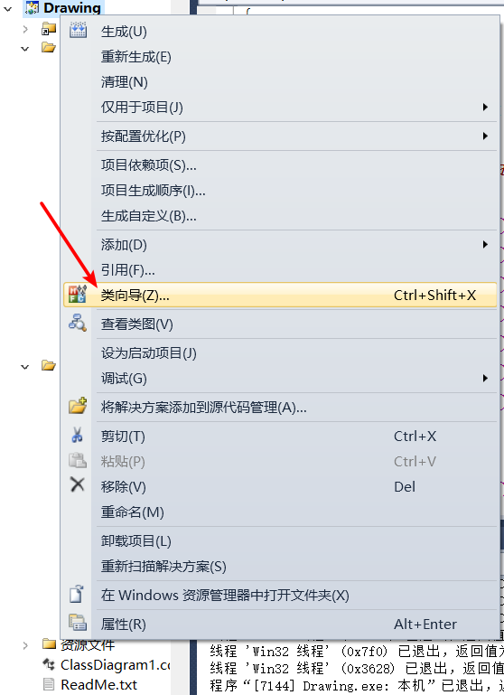

选择我们的Drawing项目（边说边坐），点击类名下拉框，我们看到我们这个项目中的所有类，下面还可以看到类的基类，资源标识符，类在哪个文件中实现，类中的成员函数等。

我们后面的很多操作都要借助这个类向导完成。

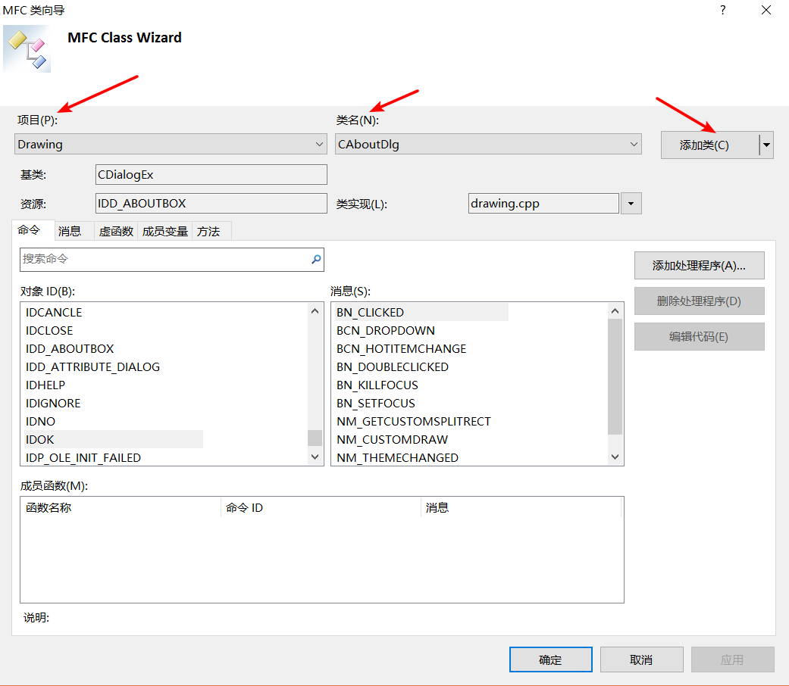

我们先用类向导创建图形对话框类，点击添加类，输入新对话框的类名，我们这里就叫 AttributeDlg吧（边说边写）。

同学们呢，还记得前面我们看的关于对话框的基类吗，没错，就是 CDialogEx（边说边选择 CDialogEx），对话框 ID我们就用默认的不改了。

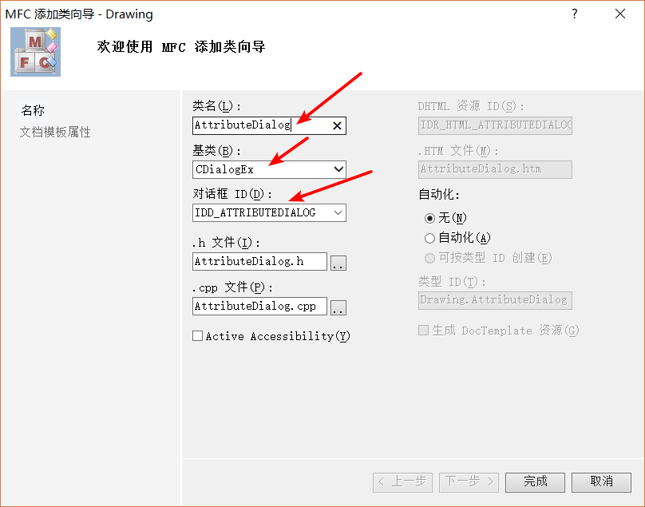

点击完成，我们的图形对话框类就创建好了，我们可以看到 MFC 类向导帮我们创建了头文件 AttributeDlg.h 和源文件 AttributeDlg.cpp。

我们再到资源视图中 Dialog 资源看一看，有个我们刚刚创建的对话框资源，点击，可以看到一个初始的对话框，点击预览按钮，就可以看到对话框运行起来的模样。

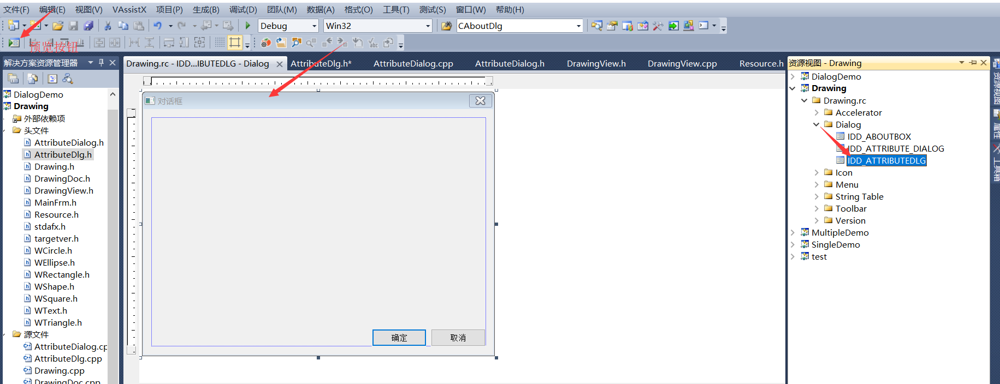

课程设计任务书中，给我们一个对话框的参考图，我们可以仿着这个图来做。（边说边打开示例图）


这个界面上的这些东西，我们称之为控件，这个示例图上是由不同类型的控件组成的界面。

我们先来认识一下这些控件（边看着示例图边讲解），图上的 **图元类型**、**原点X**、**宽度**、**线宽**、**填充风格** 等这些都是用的 **静态文本框控件**，**静态文本框控件** 用来放一些说明性的文字。

**图元类型** 后面的是 **下拉框控件**（用鼠标指指），可以下拉选择不同的选项，后面我们会将控件的相关使用。

下面这个是 **文本编辑框控件**（用鼠标指指），可以在这里面输入值，相信大家在网页登录都见过**文本编辑框**。

**静态文本框** 和 **文本域框** 外面是 **控件组合框**（用鼠标指指），把相关的多个控件包围起来，好看一点。

用来选择线色的这个是 **颜色选择框**（用鼠标指指），可以选择不同的颜色，我们在后面还会介绍另外一种颜色选择框。

用来选择线型和填充风格的这些是 **列表框**，和 **下拉框 **相比，内容显示的更多。

最下面的这两个确定和取消按钮，同学们应该都知道，这是按钮控件。

下面老师就带着大家搭建出我们的对话框界面，使用我们上面的控件。

打开我们的工具箱视图，这里面由我们要用的各种控件。（边说边打开，介绍一下红字标出的控件）


Button：普通的按钮控件，这个大家平时见的很多了。

Check Box：单选框，比如我们在选择性别的时候，用的就是单选框，也就是说只能选一个。

Edit Control：文本编辑框，比如我们输入用户名和密码的时候用的就是文本编辑框。

Combo Box：下拉框，可以下拉选择不同的内容，比如我们选择院系的时候可以用这个。

List Box：列表框，选项直接显示出来，便于选择。

Group Box：控件组框，包围多个同组的控件。

Radio Button：复选框，可以选择多个选项，比如我们人的爱好可以有很多，我们就可以用这个。

Static Text：静态文本框，常用来显示说明性的文字。

Picture Control：图片控件，用来图片的显示。

List Control：列表控件，可以用来做表格或者带滚动条的文字列表。

Tree Control：树形控件，可以用来以树形结构显示文件夹的包含关系。

Tab Control：选项卡，可以在一个页面切换不同的选项，显示不同的内容，在网页上很常见。

MFC ColorButton Control：MFC 颜色控件，可以用来选择不同的颜色。

我们学习 MFC 中的这些控件，不管对于学习网页编写还是其他编程语言的图形界面上的控件都有帮助，它们之间这点都是相通的。

只要我们分清这些控件，把相应的控件拖到界面上，来搭建我们的对话框界面。（实际操作演示）

首先是我们的图元类型，是一个静态文本框，后面是一个下拉框，控件的各个属性是在属性视图更改的，我们可以把静态文本的内容改一改，也就是改控件的 Caption 属性，在前面我们也说过。

下拉框中的内容，我们直接用代码添加，包括下面的列表框也是。

形状参数中，我们要把用户输入的项都考虑到，原点X，原点Y，宽度，高度，文本，文本角度都要有，后面我们还会根据用户的选择让一些控件隐藏或者显示。

因为我们除了绘制文本时才需要用到文本和文本角度，在其他时候，我们就可以把这几项隐藏，这就提高了软件用户的体验性。

边框风格，包括线宽，线色，边框类型，边框类型我们用下拉框或者列表框都是可以的。

填充风格和边框风格很相像，就不多说了。

老师搭建的图形界面是这样的。（展示我们搭建对话框界面）

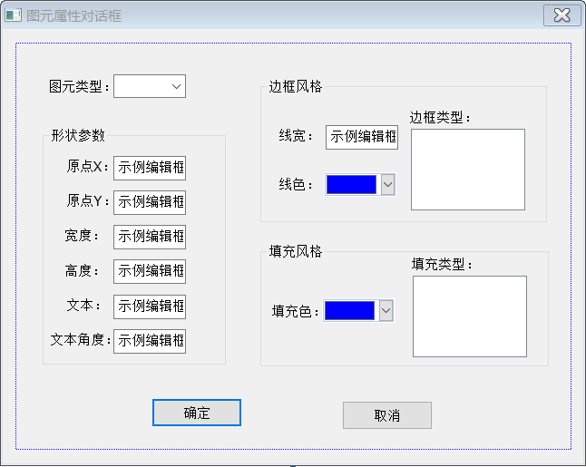

我们搭建好了对话框，我们可以预览一下，但此时我们的下拉框、边框类型、填充类型里面都还没内容。

打开对话框类的源文件，找到 OnInitDialog() 函数，在这个函数中完成对话框界面显示的初始化。

我们先来初始化下拉框中的内容，每个控件也都是一个对象，是包含在对话框这个大对象中的小对象，对话框控件对应的 MFC 类为 CComboBox。

我们使用指针指向这个下拉框对象，还记得我们在前面说的资源标识符吗？我们想要得到对话框可以使用这个资源标识符，找到下拉框对象，从而对下拉框操作。

我们创建的这个下拉框的资源标识符去哪里看呢？

打开我们对话框构建界面，在属性视图的 ID 后面就是这个控件的资源标识符。

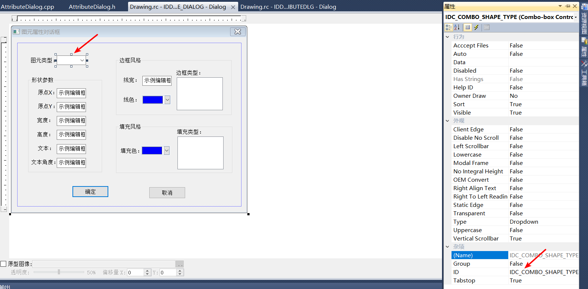

为了方便我们的使用，我们常把控件的 ID 值修改为有意义的名称。

老师这里已经修改过了，修改完后，我们可以在头文件 Resource.h 文件中查看所有的资源标识符。（打开 Resource.h 文件）

我们可以看到在这个文件中由很多的宏定义，宏名称就是资源标识符，后面的数字是具体的编号，它们是一一对应的关系。

有时候我们在属性视图中修改完后，在 Resource.h 文件中看，会发现，一个编号对应两个资源标识符。

这是因为在用属性视图我们修改 ID 后，并没有把原来的资源标识符删除，需要我们手动删除。

对我们需要使用的控件修改其 ID 值，但一般静态文本框我们只是显示一下文字，所以静态文本框的 ID，我们可以不修改。

但文本编辑框，列表框，颜色选择框，我们在后面都要使用，所以最好都修改一下 ID 值。

我们使用 GetDlgItem() 函数（边讲解边写代码），参数为控件的资源标识符，我们就可以找到具体的控件对象，然后使用指针调用控件对象中的值。

我们使用 InsertString() 函数来向下拉框中按照固定的顺序插入对象，和数组下标类似，从 0 号开始。

为了提高用户体验性，我们可以把正方形选项作为第一个选项，也就是默认选项。

列表框对应的 MFC 类是 CListBox，与下拉框的添加内容类似，我们也用 InsertString() 函数插入内容，默认第一个选项被选择。

因为我们默认的图形选项是正方形，所以为了提高用户体验性，可以把文本输入框和文本角度框隐藏，当选项是文本时，再把这些控件显示。

得到文本输入框对象后，使用 ShowWindow() 函数，参数为 SW_HIDE 时隐藏，参数为 SW_SHOW 时显示。

``` C++
// 初始化下拉列表中的内容
CComboBox* pComboBox = (CComboBox*)GetDlgItem(IDC_COMBO_SHAPE_TYPE);
pComboBox->InsertString(0, L"正方形");
pComboBox->InsertString(1, L"矩形");
pComboBox->InsertString(2, L"圆形");
pComboBox->InsertString(3, L"椭圆形");
pComboBox->InsertString(4, L"正三角形");
pComboBox->InsertString(5, L"文本");
pComboBox->SetCurSel(0); // 将第一个作为默认选项

// 初始化列表框中的内容
CListBox* pListBox = (CListBox*)GetDlgItem(IDC_LIST_BORDER_TYPE);
pListBox->InsertString(0, L"SOLID");
pListBox->InsertString(1, L"DASH");
pListBox->InsertString(2, L"DASHDOT");
pListBox->SetCurSel(0);

pListBox = (CListBox*)GetDlgItem(IDC_LIST_FILL_TYPE);
pListBox->InsertString(0, L"SOLID");
pListBox->InsertString(1, L"BDIALOGAL");
pListBox->InsertString(2, L"CROSS");
pListBox->SetCurSel(0);

// 隐藏文本输入框和文本角度框
CStatic* pStatic = (CStatic*)GetDlgItem(IDC_STATIC_TEXT);
pStatic->ShowWindow(SW_HIDE);
CEdit* pEdit = (CEdit*)GetDlgItem(IDC_EDIT_TEXT);
pEdit->ShowWindow(SW_HIDE);

pStatic = (CStatic*)GetDlgItem(IDC_STATIC_TEXT_ANGLE);
pStatic->ShowWindow(SW_HIDE);
pEdit = (CEdit*)GetDlgItem(IDC_EDIT_TEXT_ANGLE);
pEdit->ShowWindow(SW_HIDE);
```

接着我们来处理当选择文本时的显示，打开界面构建图（操作演示），选中下拉框控件，右键选择添加事件处理程序，选择第一个消息类型，添加编辑，也可以双击下拉框控件直接进行事件处理函数的编写。

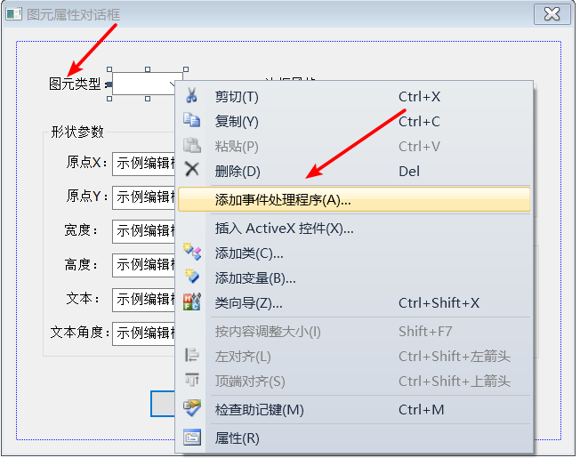

我们想要根据下拉框选择的选项来改变界面上控件的显示，那么我们如何获取下拉框选项的返回的值呢？

我们可以想添加下拉框内容那样，先用资源标识符获取到下拉框对象，然后调用 GetCurSel() 函数就可以得到下拉框选项。

注意这个函数返回的我们选择选项的序号值，就是我们插入内容时序号值。

这里我们换种方法，我们除了资源标识符，还可以直接使用变量来获取，也就是给下拉框对象起个名字，而不是一直用它的 ID 来叫它。

还是在界面构建下，选中下拉框控件，右键选择添加变量。


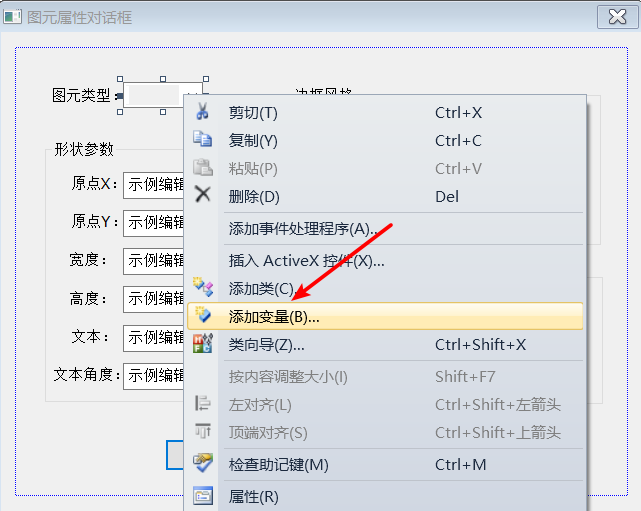

在添加成员变量向导中，填写变量名，在类别一项，可选项有 Control 和 Value。

选择 Control 类别，则变量就是控件类别的，可以直接用该变量调用该控件的函数，下拉框控件我们就添加 Control 类别的变量。

而选择 Value 类别，变量就是值类别的，可以直接获得该变量的值内容。

比如文本输入框，添加一个值类别的变量，就可以来获取这个控件的值。

一个控件是可以既有 Control 类别，又有 Value 类别的变量名的，就像一个地方可以有两个名字，北京，首都。

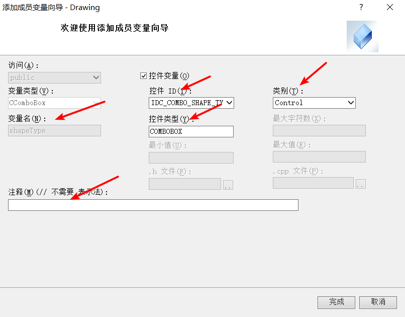

在使用添加成员变量向导之后，我们来看看都帮我们做了什么工作，打开对话框类的头文件和源文件。

我们可以看到头文件中多了我们刚才添加的变量定义，在源文件的 DoDataExchange() 函数内增加了 ID 值和变量名的绑定函数 DDX_Control()，这个函数是绑定 Control 类别的变量和资源标识符的，还有 DDX_Text() 函数是绑定 Value 类别的变量和资源标识符的。

现在我们使用下拉框 Control 类别的变量来获取下来框的下拉选项序号。（边说边写代码）

``` C++
// 点击下拉框消息的处理函数
void AttributeDialog::OnCbnSelchangeComboShapeType()
{
	// TODO: 在此添加控件通知处理程序代码
	int index = shapeType.GetCurSel(); // 根据用户选项调整界面
	if (index == 5)
	{
		// 显示文本输入框和文本角度框
		CStatic* pStatic = (CStatic*)GetDlgItem(IDC_STATIC_TEXT);
		pStatic->ShowWindow(SW_SHOW);
		CEdit* pEdit = (CEdit*)GetDlgItem(IDC_EDIT_TEXT);
		pEdit->ShowWindow(SW_SHOW);

		pStatic = (CStatic*)GetDlgItem(IDC_STATIC_TEXT_ANGLE);
		pStatic->ShowWindow(SW_SHOW);
		pEdit = (CEdit*)GetDlgItem(IDC_EDIT_TEXT_ANGLE);
		pEdit->ShowWindow(SW_SHOW);
	}
}
```

因为预览对话框，对话框的初始化是无法看到，所以还要在后面的实际运行中看到效果，下一讲，我们开始处理程序的交互逻辑。
