# 第五讲（程序的执行流程）

## 1. 显示对话框

在第四讲中，老师讲解了对话框的创建和使用，本讲将带着大家理解程序的整个执行过程。

首先同学们要理解 **消息** 这一概念，在Windows中，鼠标的移动，键盘的输入，都是一种消息，应用程序根据这些消息来执行相应的处理程序。

比如说你打开 QQ 的聊天页面，在消息栏中输入一些你想发送的消息，然后点击发送按钮，聊天消息就被发送给了对方。

这里你用键盘输入的文字，和点击发送按钮其实对于 QQ 这个应用程序来说都是消息。

QQ 应用程序根据这些消息来调用相关的函数为你处理事情，或者称之为 **事件**，比如说你的消息被发送了，消息记录中出现了你发的消息，这都是事情处理的结果。

整个 Windows 系统都是消息驱动，事件处理的，MFC 是基于 Windows 系统的，当然也是有消息产生，有事件处理的。

我们来想一想绘图程序的整个输入输出逻辑，（边讲解边运行程序）当鼠标左键单击程序的，并按下键盘上的 Ctrl 键时，弹出我们的图元属性对话框。

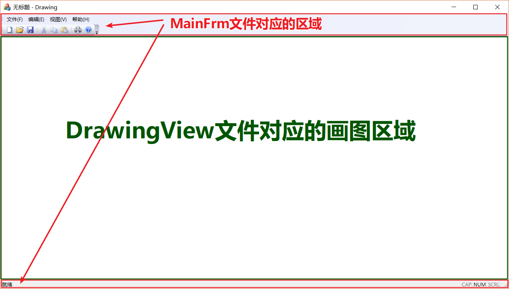

用户在往对话框输入值后，程序根据这些值来绘制具体的图形。

（边讲解边在运行的程序上比划）我们画图的区域是由 DrawingView 文件控制的，而整个程序框架上的控件是由 MainFrm 文件控制的。

我们要在画图区域操作，就要在 DrawingView 文件中添加代码，和我们在对话框上的事件处理一样，打开类向导。

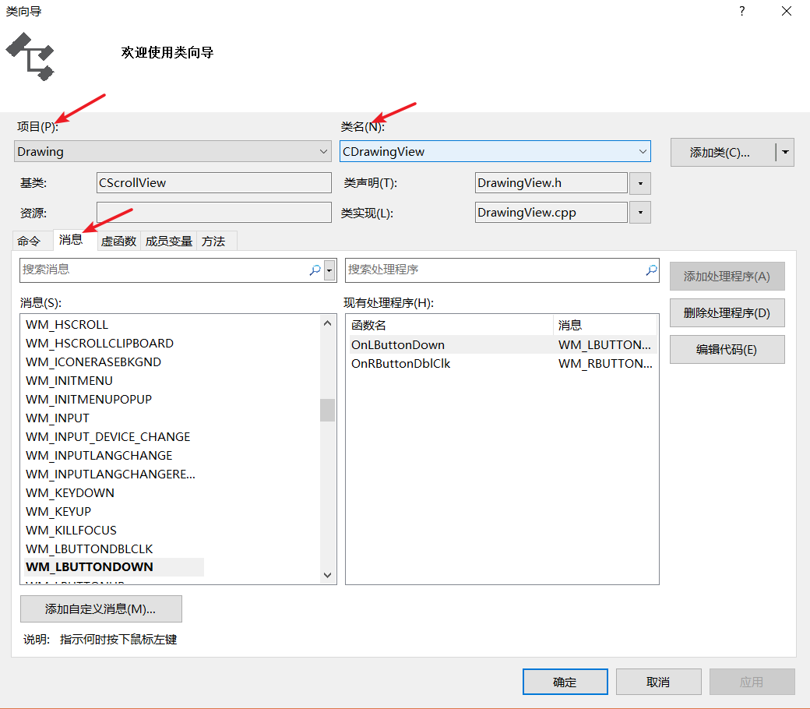

在消息一项中找到鼠标左键单击的消息名，添加处理程序，这样在消息产生后，程序就可以对这个消息做出相应的操作，比如弹出我们的对话框。

消息都是以 WM 作为前缀开头，因为是 Window Message 窗口消息嘛，鼠标左键按下的消息是 WM_LBUTTONDOWN，添加处理程序。

通过上面的操作，我们来看看类向导为我们做了什么，打开 DrawingView.h 文件，可以看到新增的消息映射函数，`afx_msg void OnLButtonDown(UINT nFlags，CPoint point)`，这个函数来处理我们鼠标左键按下的消息。

所谓映射就是一一对应的关系，一个消息只能对应一个处理函数，而一个处理函数也只能处理一个消息。

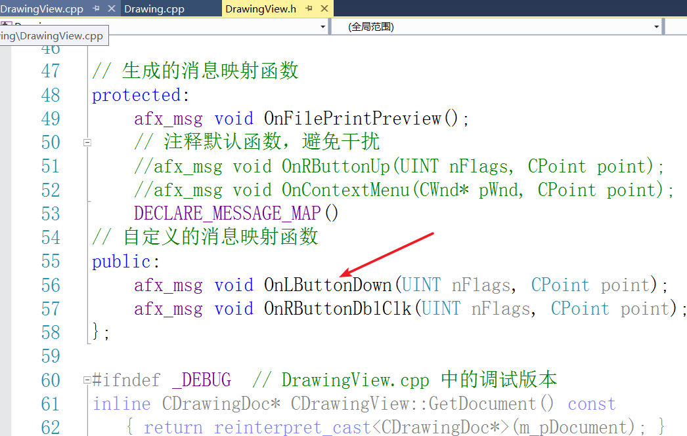

我们在函数实现中完成弹出对话框的操作。

在使用框架时，很重要的能力是模仿，看看框架中的示例程序，能够更好的帮助我们理解和使用框架。

如果我们把关于对话框的显示弄明白了，显示我们自己创建的对话框也自然没有问题。

打开 Drawing.cpp 文件，找到 OnAppAbout() 函数，这里面的代码就是让关于对话框显示出来的。


仿着这个来写我们对话框的显示，找到刚才的消息处理函数，使用我们的对话框类 AttributeDialog，创建对话框对象，调用 DoModal() 函数就可以让对话框显示出来了。（边讲解边写代码）

``` C++
// 按下鼠标左键的消息响应函数
void CDrawingView::OnLButtonDown(UINT nFlags, CPoint point)
{
	AttributeDialog dialog;
	dialog.DoModal();
}
```

我们再来运行程序，在程序中单击鼠标左键，对话框就可以显示出来了。

不过课程设计任务书上还要求按下 Ctrl 键，这个也好办，我们只需要在按下鼠标左键时，判断 Ctrl 键是否也被按下。

消息映射函数中的参数 nFlags 是无符号长整型，无法直接和键盘按键消息 16 进制数对比，需要先与 MK_CONTROL 做相与逻辑运算后再和 MK_CONTROL 比较判断真假。

``` C++
// 按下鼠标左键的消息响应函数
void CDrawingView::OnLButtonDown(UINT nFlags, CPoint point)
{
	if ((nFlags&MK_CONTROL) == MK_CONTROL)
	{
		AttributeDialog dialog;
		dialog.DoModal();
	}
}
```

我们的对话框可以显示了，我们下一步是要得到在对话框输入的值。

打开我们创建的对话框类 AttributeDialog 的源文件，（边说边打开 AttributeDialog.cpp 文件），在 DoDataExchange() 函数中，实现对话框界面和变量的绑定。

也就是说，通过界面输入的值会赋值给对应的变量。

我们在前面根据用户的选项来改变对话框界面的显示时，已经添加了一个下拉框对应的 Control 类别的变量 shapeType。（找到 OnCbnSelchangeComboShapeType() 函数）

我们根据这个变量使用 GetCurSel() 函数来获取用户选择的选项序号，而不是直接获取用户选择的值。

对于文本编辑框，我们可以直接使用 Value 类别的变量获取输入的值，还是在类向导中给控件添加变量，比如我们给原点X 后面的文本编辑框添加一个 Value 类别的变量。（演示一下）

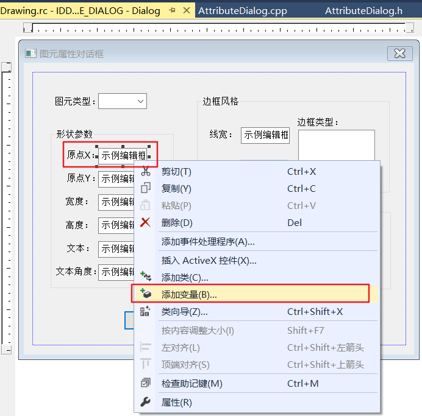

这样用户输入的原点X 的值就会赋给文本编辑框控件对应的 Value 类别的变量，实现了界面值到变量值的传递。

MFC 中 Value 类别的变量类型有 int 类型和 CString 类型，分别和 C++ 中的 int 类型和 String 类型对应。

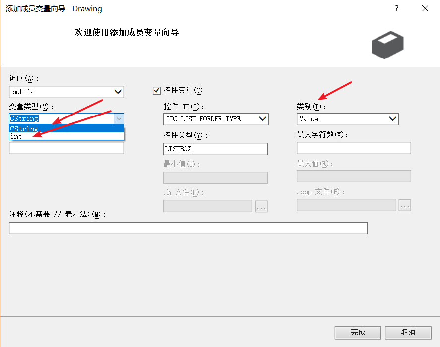

根据文本编辑框输入值的类型来决定对应 Value 类别控件变量的类型。

对于文本编辑框来说，我们只需要绑定 Value 类别的控件变量即可，而对于下拉框，列表框，颜色选择框，我们要用 Control 类别的控件变量获取选择的值。

根据我们所需的值，同学们自己添加相应的控件变量。

可以在 AttributeDialog.h 文件中看到我们添加的控件变量。

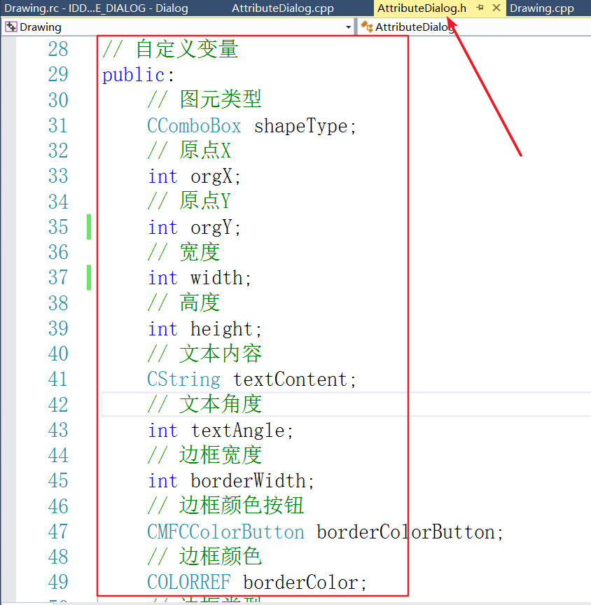

同学们再想一想，我们什么时候获取控件变量的值呢？

用户输入完毕后，选择图元的类型，在按下图元属性对话框上的确定按钮后，对话框消失，我们就无法知道对话框界面上输入的值了。

所以我们要在**对话框消失之前**，用户**按下确认按钮之后**获取对话框界面上的值。

我们就需要编写处理按下确认按钮消息的处理函数，可以在对话框编辑界面双击确定按钮进入按钮点击函数的编写。

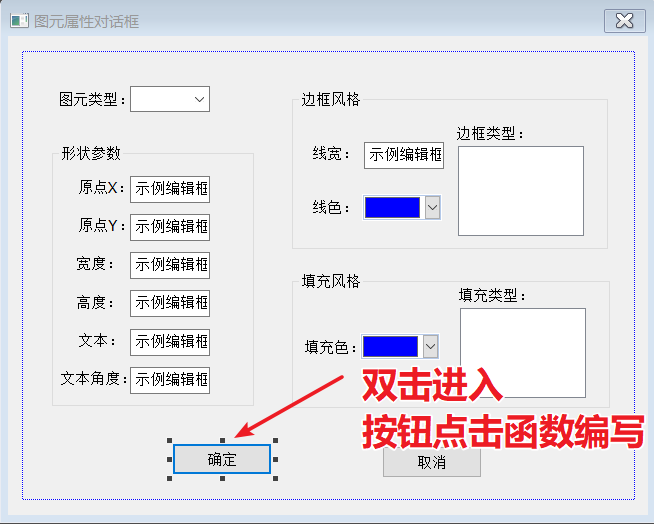

`CDialogEx::OnOK();`这一句是调用对话框父类 CDialogEx 的 OnOK() 函数，更新对话框界面上的值到对应的控件变量中。

所以我们添加的代码要写到这一句的后面，而不能写到这一句代码之前，否则就无法获得最新的对话框界面的值。

下面我们来编写我们的 OnBnClickedOk() 函数。（边说边写）

我们要获取图形类型的选项，因为我们要靠这个来决定绘制正方形还是矩形还是其他的图形。

我们还要获取变量类型的选项值，填充类型的选项值，边框颜色的值，填充颜色的值。

为了方便记录图形类型的选项，边框类型的选项，填充类型的选项，我们可以在头文件中自定义三个变量 comboxIndex，borderTypeIndex，filltypeIndex分别来记录。

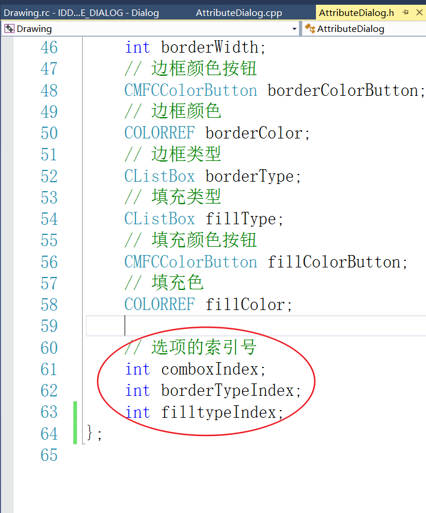

``` C++
void AttributeDialog::OnBnClickedOk()
{
	// TODO: 在此添加控件通知处理程序代码
	CDialogEx::OnOK();
	comboxIndex = shapeType.GetCurSel(); // 获取图形类型选项值
	borderTypeIndex = borderType.GetCurSel(); // 获取边框类型选项值
	filltypeIndex = fillType.GetCurSel(); // 获取填充类型选项值
	borderColor = borderColorButton.GetColor(); // 获取边框颜色值
	fillColor = fillColorButton.GetColor(); // 获取填充颜色值
}
```

获取界面上的值之后，我们就可以根据这些值来绘制我们的图形了。

回到 DrawingView.cpp 文件的 OnLButtonDown() 函数，（鼠标指到这里）我们创建对话框对象，并使对话框已经显示了。

这里要获取鼠标的位置，涉及到设备坐标转换成逻辑坐标（DP->LP）的问题，课程设计任务书中已经给出了代码。（鼠标指到这里）

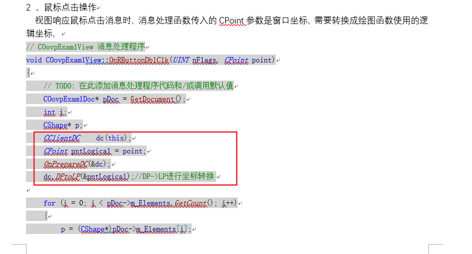

我们可以在**对话框显示之前**获取逻辑坐标，然后当**对话框显示之后**让鼠标的坐标位置显示出来。（边写代码边讲解）

根据对话框的 DoModal() 函数的返回值，我们可以知道对话框界面上的确定按钮是否被按下，进而获取我们想要的值。

我们获取值时不管绘制的是什么图形，要把界面上所有的值都获取到，不同的图形使用的值也不同，各取所用。

根据用户选择的图形类型，我们来绘制相关的函数，我们可以用一个 switch 语句来做。

按照我们设置的图形序号，是 0 就绘制正方形，是 1 就绘制矩形，是 2 就绘制圆形，是 3 就绘制椭圆形，是 4 就绘制正三角形，是 5 就绘制文本。

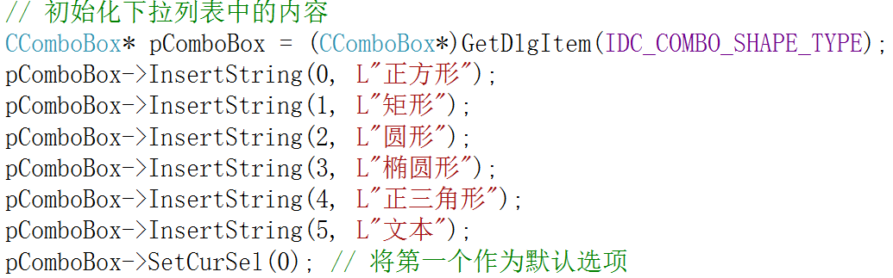

``` C++
// 按下鼠标左键的消息响应函数
void CDrawingView::OnLButtonDown(UINT nFlags, CPoint point)
{
	// TODO: 在此添加消息处理程序代码和/或调用默认值
	// 设备坐标转换成逻辑坐标（DP->LP）
	CClientDC dc(this);
	CPoint pntLogical = point;
	OnPrepareDC(&dc);
	dc.DPtoLP(&pntLogical);

	// 判断在鼠标左键按下的同时，Ctrl键是否按下
	if ((nFlags&MK_CONTROL) == MK_CONTROL)
	{
		AttributeDialog dialog; // 创建对话框对象
		// 在对话框显示之前获取逻辑坐标
		dialog.orgX = pntLogical.x;
		dialog.orgY = pntLogical.y;
		// 对话框的返回值是否是IDOK
		if(dialog.DoModal() == IDOK)
		{
			//获取图形的属性
			int orgX = dialog.orgX;
			int orgY = dialog.orgY;
			int width = dialog.width;
			int height = dialog.height;
			CString textContent = dialog.textContent;
			int textAngle = dialog.textAngle;
			int borderWidth = dialog.borderWidth;
			int borderType = dialog.borderTypeIndex;
			COLORREF borderColor = dialog.borderColor;
			int fillType = dialog.filltypeIndex;
			int fillColor = dialog.fillColor;
			int comboxIndex = dialog.comboxIndex;
			switch(comboxIndex)
			{
			case 0:
				{
					// 正方形
					WSquare *p = new WSquare(orgX, orgY, width, borderWidth, borderType, borderColor, fillType, fillColor);
					// 绘制正方形
				}
             ...
		}
	} 
}
```

绘制图形，肯定是调用图形对象中的绘图函数啦，但是我们还要在每个 case 语句中传入设备指针 CDC* pDC。

用心的同学可能已经发现 DrawingView.cpp 文件有一个 OnDraw() 函数，（鼠标指到这里），这个函数是绘制程序的整个 View 界面的，而每个图形中的 Draw() 函数只是这个 OnDraw() 函数绘制的一小部分。

每个图形的绘图函数要受这个 OnDraw() 函数的调控，我们还可以看到这个函数中有 CDrawingDoc 类的对象，这是我们整个程序的数据文档存储对象。

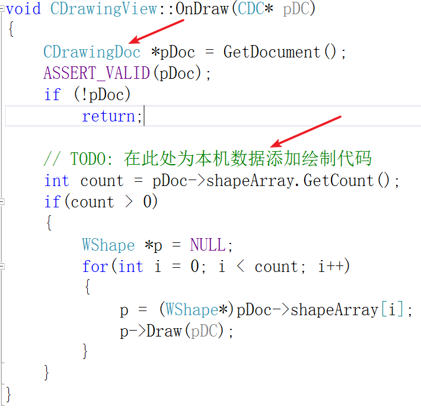

我们应该把我们绘制的图形都保存到这个文档对象中，然后在这个 OnDraw() 函数逐一绘制，刷新界面就可以看到绘制的图形，这就是绘图的整个流程。

现在我们再打开 DrawingDoc.h 和 DrawingDoc.cpp 文件，既然我们要保存绘制的图形，就需要一个集合对象来保存这些图形对象。

这里我们使用数组来保存，也便于图形对象的存取，我们在DrawingDoc的头文件中加上 `CObArray shapeArray; // 图元数组`。

所以在 case 语句中，我们只需要将图形对象保存到文档对象CDrawingDoc的数组中，然后再 OnDraw() 函数中取出，执行绘图函数 Draw()，刷新界面即可。

下面继续 OnLButtonDown() 函数的编写，我们要使用文档对象的数组，就需要获得这个对象，和 OnDraw() 函数中的写法一样 `CDrawingDoc *pDoc = GetDocument();`。（边讲解边写代码）

所以正方形的代码就是：

``` c++
case 0:
{
    // 正方形
    WSquare *p = new WSquare(orgX, orgY, width, borderWidth, borderType, borderColor, fillType, fillColor);
    pDoc->shapeArray.Add(p);
    break;
}
```

其他图形的写法类似，同学们自己完成。

```C++
if ((nFlags&MK_CONTROL) == MK_CONTROL)
	{
		AttributeDialog dialog; // 创建对话框对象
		// 在对话框显示之前获取逻辑坐标
		dialog.orgX = pntLogical.x;
		dialog.orgY = pntLogical.y;
		// 对话框的返回值是否是IDOK
		if(dialog.DoModal() == IDOK)
		{
			//获取图形的属性
			int orgX = dialog.orgX;
			int orgY = dialog.orgY;
			int width = dialog.width;
			int height = dialog.height;
			CString textContent = dialog.textContent;
			int textAngle = dialog.textAngle;
			int borderWidth = dialog.borderWidth;
			int borderType = dialog.borderTypeIndex;
			COLORREF borderColor = dialog.borderColor;
			int fillType = dialog.filltypeIndex;
			int fillColor = dialog.fillColor;
			int comboxIndex = dialog.comboxIndex;
			switch(comboxIndex)
			{
			case 0:
				{
					// 正方形
					WSquare *p = new WSquare(orgX, orgY, width, borderWidth, borderType, borderColor, fillType, fillColor);
					pDoc->shapeArray.Add(p);
					break;
				}
             ...
             }
			Invalidate();//刷新窗口
		}
	} 
```

在 switch 语句之后，我们调用 Invalidate() 函数刷新整个程序窗口，这个刷新函数会调用 OnDraw() 函数，我们接着来编写 OnDraw() 函数。（边讲解边写代码）

我们可以得到图形数组中的对象数量，遍历数组，利用多态性，使用图形基类的父类指针指向数组中的每个图形对象，调用子类中的 Draw() 函数，这样就完成了整个图形的绘制了。

``` C++
void CDrawingView::OnDraw(CDC* pDC)
{
	CDrawingDoc *pDoc = GetDocument();
	ASSERT_VALID(pDoc);
	if (!pDoc)
		return;

	// TODO: 在此处为本机数据添加绘制代码
	int count = pDoc->shapeArray.GetCount();
	if(count > 0)
	{
		WShape *p = NULL;
		for(int i = 0; i < count; i++)
		{
			p = (WShape*)pDoc->shapeArray[i];
			p->Draw(pDC);
		}
	}
}
```

每次程序界面刷新，我们创建的图形都会重新绘制一遍，因为计算机的速度很快，我们很难感受到这种图形绘制的过程，感觉像是新图形在原来已经绘制好的图形基础上添加上去的一样。

至此图形绘制的功能就已经完成了，下面我们来完成剩余的功能。

当只按下鼠标左键而没有按下 Ctrl 键时，我们要判断，鼠标是否落在了已经绘制的图形内（运行程序，绘制图形，举例说明）。

判断鼠标是否落在了已有的图形当中，需要使用数组中图形对象的 IsMatched() 函数一一调用。（边讲解边写代码）

如果鼠标落在了某一个图形内，为了更好的用户体验性，我们可以把被选中的图形的参数显示在对话框的相应位置。

和绘制图形一样，在确定按钮按下后，改变图形的属性值，刷新窗口，重新绘制整个界面。

``` C++
// 判断鼠标的落点是否在图元内，修改操作
else 
{
    //未按下Ctrl键时左击，则逐个比较，看是否命中图元
    WShape *p = NULL;
    int count = pDoc->shapeArray.GetCount();
    for (int i = 0; i < count; i++)
    {
        p = (WShape*)pDoc->shapeArray[i];
        if (p->IsMatched(pntLogical))
        {
            //修改图元属性，从图元属性值里面取值赋值给对话框的变量
            AttributeDialog dialog;
            dialog.orgX = p->OrgX;
            dialog.orgY = p->OrgY;
            dialog.borderColor = p->BorderColor;
            dialog.borderWidth = p->BorderWidth;
            dialog.borderTypeIndex = p->BorderType;

            if (dialog.DoModal() == IDOK)
            {
                //利用改了以后对话框中图元的属性更新到文档图元数组的对象中
                p->OrgX = dialog.orgX;
                p->OrgY = dialog.orgY;

                p->BorderColor = dialog.borderColor;
                p->BorderWidth = dialog.borderWidth;
                p->BorderType = dialog.borderTypeIndex;

                p->FillColor = dialog.fillColor;
                p->FillType = dialog.filltypeIndex;

                p->SetAttribute(p->OrgX, p->OrgY, p->BorderColor, p->BorderType, p->BorderWidth, p->FillColor, p->FillType);
            }
            Invalidate();//刷新窗口
        }
    }
}
```

图形的删除功能，同学们想一想该如何实现呢？

课程设计任务书上要求鼠标右键双击某个图形，删除某个图形。

图形对象保存在一个数组中，我们只要把要删除的图形对象从数组中移除，然后刷新窗口，重新绘制剩下的图形，给人的印象就是删除了某个图形。

和图形修改功能类似，删除图形也要先判断是哪个图形，也是使用图形对象的 IsMatched() 函数逐个比对。

找到想要删除的图形后，为了做的用户体验性更好一点，可以使用简单消息对话框函数 AfxMessageBox()，让用户再次确认是否要删除图形。

消息对话框函数 AfxMessageBox() 的第一个参数是要显示的文本内容，第二个参数决定对话框上的按钮，比如我们只想有确定和取消按钮，就可以将第二个参数设为 MB_OKCANCEL。

根据对话框函数的返回值，来判断用户是否真的要删除，同学们可在网上搜索这个消息对话框函数的其他参数，推荐大家去微软官方的文档中心查询，网址 https://msdn.microsoft.com/zh-cn/library/。（打开网址）


在搜索栏输入我们要查询的函数，比如就是这个消息对话框函数 AfxMessageBox() 吧，我们可以在这里找到这个函数的详细介绍。（带着同学们浏览一下网页）

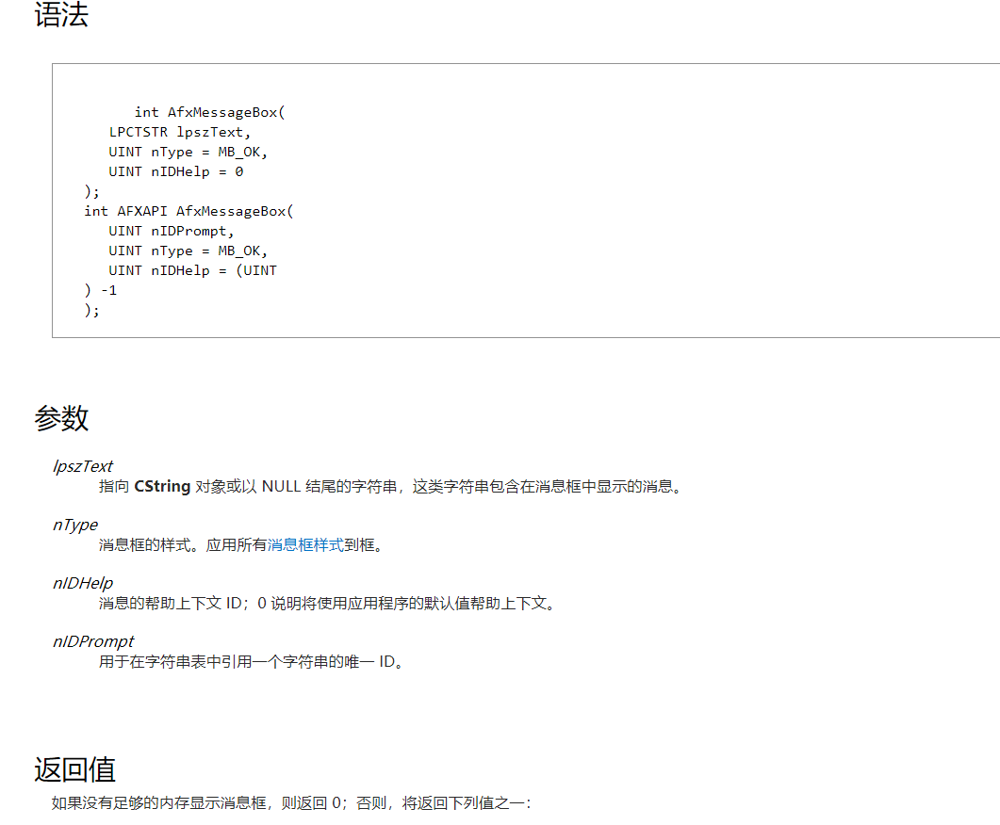

下面老师带着大家看一下这个 OnRButtonDblClk() 函数，数组中有删除某个元素的函数 RemoveAt() ，参数为要删除的元素的下标。

（编写代码）

``` C++
void CDrawingView::OnRButtonDblClk(UINT nFlags, CPoint point)
{
	// TODO: 在此添加消息处理程序代码和/或调用默认值
	CDrawingDoc *pDoc = GetDocument();

	CClientDC dc(this);
	CPoint pntLogical = point;
	OnPrepareDC(&dc);
	dc.DPtoLP(&pntLogical);//DP->LP进行转换 

	WShape* p;
	int count = pDoc->shapeArray.GetCount();
	for (int i = 0; i < count; i++)
	{
		p = (WShape*)pDoc->shapeArray[i];
		if (p->IsMatched(pntLogical))
		{
			int value = AfxMessageBox(L"你是否要删除？", MB_OKCANCEL);
			if(value == IDOK)
				pDoc->shapeArray.RemoveAt(i);
		}
	}
	Invalidate();//刷新窗口
}
```

图形的保存功能看起来很难，其实只需要很少的代码。

（打开 DrawingDoc.cpp 文件鼠标指到 Serialize() 函数）这个函数是整个程序的序列化函数，整个程序的的序列化操作都在这个函数中完成。

我们直接使用图形数组对象中的 Serialize() 函数，即可完成数组中每个图形对象的序列化，所以代码只要这一句 `shapeArray.Serialize(ar);`。（边讲解边写上）

CArchive类在前面类的设计时讲过，它是负责向文件中读写的类，使用它来完成保存文件和打开文件等操作。

``` C++
// CDrawingDoc 序列化
void CDrawingDoc::Serialize(CArchive& ar)
{
	shapeArray.Serialize(ar);
}
```

到目前为止，我们的程序就算基本完成了。

同学们可以运行一下，看看有没有问题，这里老师就不带着大家运行了。

下面我们总结一下整个程序的执行流程。

我们这是一个绘图程序，程序的主类 CDrawingApp 负责整个绘图程序的启动和初始化，这个类是整个程序的司令官。

CMainFrame 类只是负责程序的主框架窗口，窗口上的工具栏，状态栏等都是该类管理的。

CDrawingView 类负责 View 界面的用户交互，处理界面上的消息，显示程序的数据对象，来完成整个程序的功能。

CDrawingDoc 类负责整个程序的数据存储，序列化操作就是典型的数据存取。

本次课程设计的程序是典型的 MFC 应用程序，程序的各个类各司其职，共同完成整个程序具有的功能。

写一个程序要处理的两大问题：

1.数据对象是什么，也可以说是数据模型，本程序的数据对象是图形对象，数据封装成对象存储。

2.数据对象怎么展示，也就是程序的界面，PC端的程序可以是 Windows 程序界面，也可以是基于浏览器的网页，在手机上可以是安卓界面，界面不同，处理的繁易也有区别，但是处理的逻辑大同小异。

不管再复杂的程序，核心都是解决这两个问题。

下一讲，老师将针对往年同学在课程设计中犯得错误做出总结和讲解，避免你们这一届的同学再犯。


